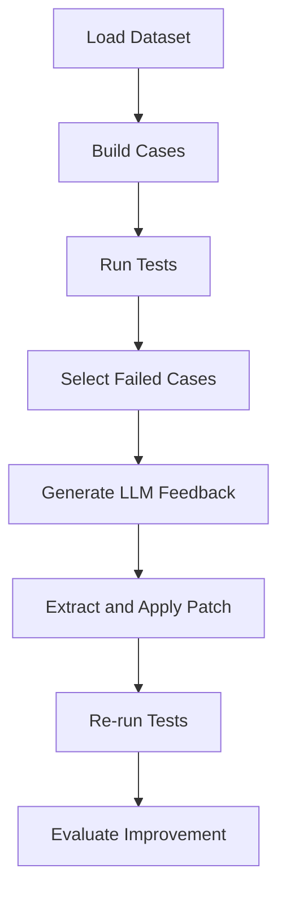

# LLM-Based Feedback and Code Repair for Programming Tasks

## Overview
This project explores the use of LLMs to automatically generate feedback and code fixes for incorrect student programming solutions. The system works on failing student code by identifying potential errors, providing feedback and suggesting minimal patches. These suggested fixes are then applied to the original code to evaluate if they improve the correctness.
The project is based on real student data from the Hamburg programming dataset, which contains Java and Python tasks from an Algorithms and Data Structures course.

## Project Goal
The goal of this project is to evaluate whether a LLM can identify errors in incorrect student submissions and suggest small fixes that improve the code.

## Dataset
The project uses the Hamburg dataset which includes students programming exercises from Algorithm and Data Structure course collected over three Winter terms.
* Each year includes:
  - Task descriptions
  - Student submission
  - Test cases
The student submissions are not usually complete programs. They are mostly functions or methods that are combined with tester code during evaluation.

## Pipeline
The project workflow:
1. Load and preprocess the dataset
2. Match student submission with task description to create cases
3. Run each submission (cases) against provided tests
4. Identify and select the submissions that fail at least one test
5. Generate LLM feedback for each failed submission where the feedback contains:
    - Identified error
    - Diagnosis
    - Hints
    - The original buggy code block
    - A corrected replacement block
6. Apply the suggested patch
7. Re-run the tests on the patched code
8. Compare results before and after patching

## Pipeline Diagram



## Results

| Year      | Total Failed | Passed All After Patch | Improved | No change |
|-----------|--------------|------------------------|----------|-----------|
| 2019-2020 | 11           | 9                      | 10       | 1         |
| 2020-2021 | 16           | 13                     | 13       | 3         |
| 2021-2022 | 14           | 2                      | 2        | 12        |

> **Note :**
> Precomputed results are already available in the outputs folder. The project can be evaluated without running the full pipeline.

## Setup

### Install dependencies:
```bash
pip install -r requirements.txt
```

### API Key Setup

Create a .env file in the project root:
```bash
OPENAI_API_KEY=your_api_key_here
```

> **Note :**
> To run the pipeline you must add an OpenAI API Key.

## Running the pipeline

Run the scripts in order:
```bash
python src/data/load_hamburg.py
python src/data/build_cases.py
python -m src.grading.evaluation
python src/tutoring/failed_cases.py
python src/tutoring/feedback.py
python -m src.tutoring.patch
```